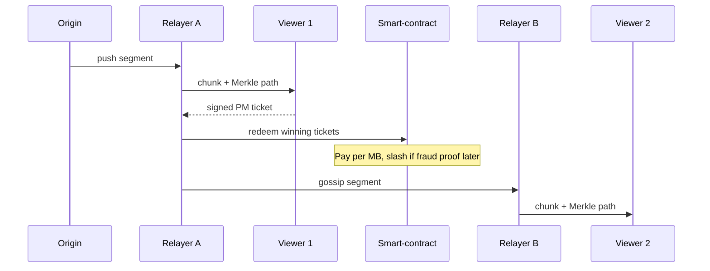

Below is a **concrete-but-modular architecture** that shows how ClusterCast can move live video around the planet **without any traditional CDN edge servers**, yet still achieve provable delivery and trust-minimized payments.

---

## 1.  Roles and overlay network

| Role                   | Typical location                    | Main functions                                                                      |
| ---------------------- | ----------------------------------- | ----------------------------------------------------------------------------------- |
| **Origin broadcaster** | Studio / creator PC                 | Pushes the primary stream into the overlay.                                         |
| **Relayer nodes**      | Any wallet holder with spare uplink | Ingest from the origin or another relayer and forward chunks to downstream viewers. |
| **Viewers**            | End-users                           | Request/verify chunks, issue payment tickets, blacklist bad relayers.               |

Connections use **WebRTC DataChannels or QUIC** so that most peers can “dial” each other directly through NAT and keep latency low. A libp2p-style DHT advertises which relayers hold which chunk IDs. ([GitHub][1])

---

## 2.  Content integrity: Merkle-chunked live HLS

1. The origin encoder cuts the video into normal 2-second HLS (or DASH) *segments*.
2. Every segment is **hash-chunked** and inserted into a rolling Merkle tree; the root for each 2-second window is signed by the broadcaster and gossiped through the DHT.
3. When a relayer hands a viewer a chunk, it also supplies the Merkle *proof path*.
4. The viewer verifies the hash path against the signed root **locally**, so no third-party auditor is needed.

If a relayer omits bytes or sends garbage, the signature check fails immediately and the viewer can refuse to pay (and optionally gossip a misbehaviour flag).

---

## 3.  Micropayments without per-chunk on-chain gas

On-chain transfers for every 2 s segment would explode gas costs, so ClusterCast re-uses the battle-tested pattern from Livepeer and Theta:

| Technique                             | How it fits                                                                                                                                                                                                                                                  |
| ------------------------------------- | ------------------------------------------------------------------------------------------------------------------------------------------------------------------------------------------------------------------------------------------------------------ |
| **Probabilistic Micropayments (PMs)** | Viewers deposit e.g. 10 USDC in a `TicketBroker` contract, then attach *lottery tickets* to each verified chunk. Only \~1 in N tickets is a winner worth `N × fee`, so 1–2 on-chain calls per minute settle thousands of packets. ([Medium][2], [GitHub][3]) |
| **Payment channels / state streams**  | If ClusterCast runs on an L2, relayer and viewer can open a unidirectional channel; periodic hashed-timelock commitments settle to L1 only when they close.                                                                                                  |
| **Theta-style aggregate receipts**    | A relayer bundles signed receipts from many viewers, proves it served *M* megabytes, and withdraws a single lump sum. ([Medium][4])                                                                                                                          |

Because every payment is conditioned on the *viewer’s signature that a verified chunk arrived*, a dishonest relayer cannot invoice for bytes it never delivered.

---

## 4.  Discovery, reputation & QoS

* **Stake-weighted registration** – a relayer must bond tokens in the contract; viewers automatically prefer nodes with higher historical delivery ratios.
* **Slashing** – a viewer can submit a cryptographic fraud proof (invalid chunk + relayer signature) within a short window. If valid, part of the relayer’s stake is burned and the viewer is refunded.
* **Real-time fallback** – the player requests the next chunk from an alternate peer if latency > X ms, exactly as WebTorrent/HLS-js swarms behave today.

This peer-selection loop plus economic penalties converges on CDN-level reliability — the same principle that file-sharing swarms used to hit 99 % availability a decade ago, now with money on the line. Recent market reports already show commercial P2P CDNs scaling to multiple Tbps for VOD and live events. ([GlobeNewswire][5])

---

## 5.  Putting it together — end-to-end flow

1. **Segment creation (0 ms)** – Origin signs Merkle root R₄₂.
2. **P2P hop (\~20–150 ms)** – Relayer A fetches and forwards.
3. **Local verify (\~1 ms)** – Viewer checks path against R₄₂.
4. **Ticket issue (\~1 ms)** – Viewer countersigns PM.
5. **Batch settle (every few minutes)** – Relayer posts a bundle of winning tickets on-chain.

No centralized ingest or edge clusters ever see the traffic; the only shared source of truth is the blockchain contract plus the broadcaster’s signed roots.

---

### Why a centralized CDN genuinely can’t be swapped in later

* **Economic alignment lives on-chain** – Reward splits, slashing rules and probabilistic payout odds are executed by the contract; a legacy CDN can’t expose those guarantees because its ledger is opaque.
* **Cryptographic proofs are end-to-end** – Any attempt to re-route through a private edge breaks the Merkle path and nullifies payment.
* **Global low-value settlement** – Credit-card processors charge 2 % + \$0.30, obliterating the unit economics of sub-dollar bandwidth fees that PMs make viable.

---

## Implementation status & next steps

* **Libraries you can use today:**

  * `simple-peer` or `libp2p` for WebRTC pipes. ([GitHub][1])
  * Livepeer’s open-source `ticketbroker` contracts for PMs (forkable to any EVM chain). ([GitHub][3])
* **Research frontier:** “proof-of-bandwidth” schemes that let a smart contract sample packets itself instead of relying on viewer receipts—active 2024 topic in P2P CDN papers. ([ResearchGate][6])
* **MVP suggestion:** Start with an L2 such as Arbitrum or Optimism to keep redemption gas <\$0.01 and bundle Merkle roots in an IPFS pubsub feed before deciding how much metadata needs on-chain anchoring.

With these components, ClusterCast offers *verifiably delivered* live video, pays the people who lend uplink capacity, and never depends on a traditional CDN stack.

[1]: https://github.com/feross/simple-peer?utm_source=chatgpt.com "feross/simple-peer: Simple WebRTC video, voice, and data channels"
[2]: https://medium.com/livepeer-blog/a-primer-on-livepeers-probabilistic-micropayments-e16788b29331?utm_source=chatgpt.com "A Primer on Livepeer's Probabilistic Micropayments - Medium"
[3]: https://github.com/livepeer/wiki/blob/master/spec/streamflow/pm.md?utm_source=chatgpt.com "wiki/spec/streamflow/pm.md at master · livepeer/wiki - GitHub"
[4]: https://medium.com/theta-network/theta-labs-granted-2nd-us-patent-for-ultra-high-transaction-throughput-micropayments-to-support-43308898053b?utm_source=chatgpt.com "Theta Labs Granted 2nd US patent for Ultra-high Transaction ..."
[5]: https://www.globenewswire.com/news-release/2024/11/06/2975886/28124/en/Commercial-Peer-to-Peer-P2P-Content-Delivery-Network-CDN-Market-Research-Report-2024-2030-Shift-Toward-Decentralized-Content-Delivery-Models-in-Enterprises-Drives-Adoption-of-P2P-C.html?utm_source=chatgpt.com "Commercial Peer-to-Peer (P2P) Content Delivery Network"
[6]: https://www.researchgate.net/figure/Average-of-upload-bandwidth-contribution-of-P2P-end-users-in-HCDN-using-HRA-HRR-and_fig5_284358219?utm_source=chatgpt.com "Average of upload bandwidth contribution of P2P end-users in ..."
